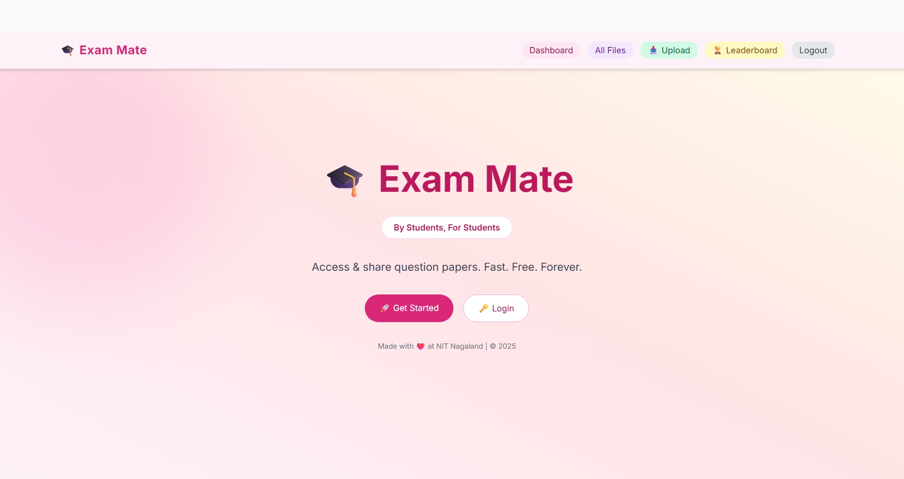
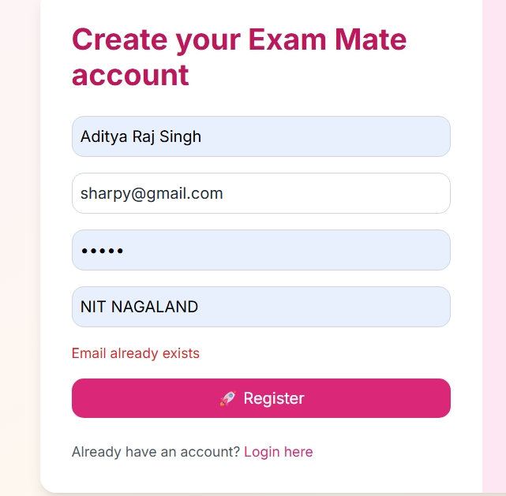
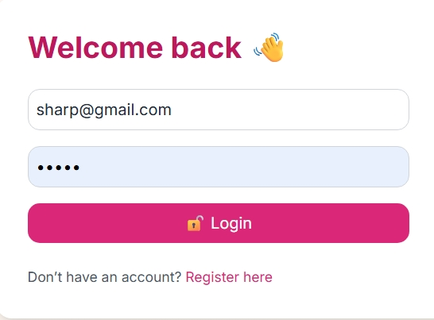
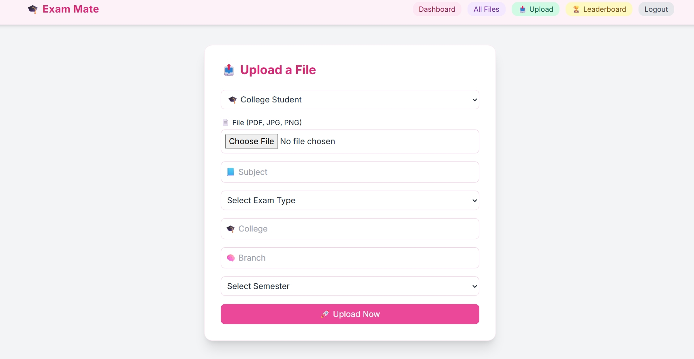
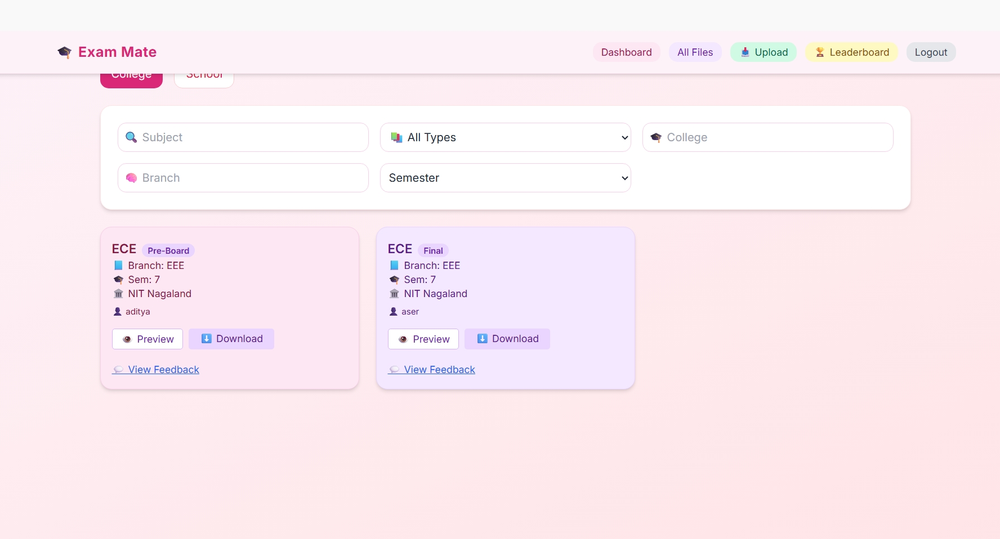
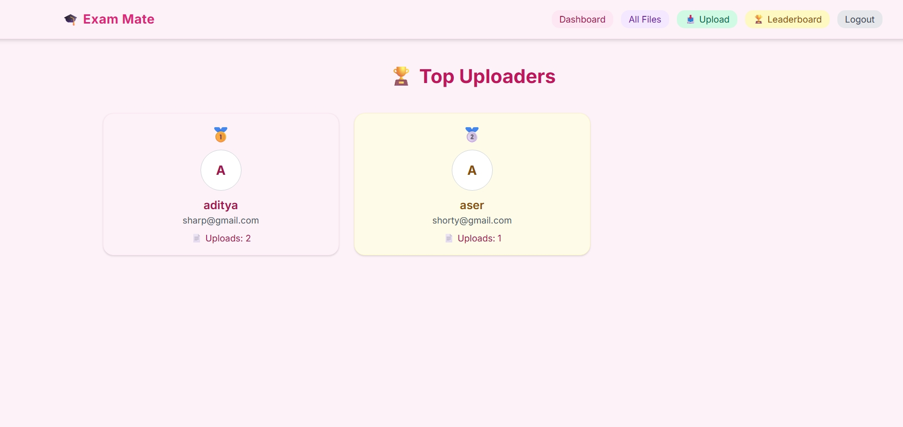

<p align="center">
  
</p>

<h1 align="center">📚 Exam Mate</h1>
<p align="center">A full-stack platform for students to access, upload & share exam papers, notes, and study resources.</p>

---


[](https://YOUR-DEPLOYED-FRONTEND-LINK)

---

## 📑 Table of Contents
- [Why Exam Mate?](#-why-exam-mate)
- [✨ Features](#-features)
- [📸 Screenshots](#-screenshots)
- [🛠 Tech Stack](#-tech-stack)
- [⚙️ Installation](#️-installation)
- [🚀 Deployment](#-deployment)
- [🔑 Environment Variables](#-environment-variables)
- [🤝 Contributing](#-contributing)
- [📜 License](#-license)

---

## 📌 Why Exam Mate?

Students often struggle to find reliable previous year papers or study resources. **Exam Mate** centralizes these resources in **one platform**, making exam preparation easier, faster, and more organized.

---

## ✨ Features

### 🔹 Backend
✅ Node.js + Express + MongoDB Atlas  
✅ JWT Authentication (Register/Login/Logout)  
✅ File upload/download (PDF, DOC, Images)  
✅ Secure routes with auth middleware  
✅ File preview (PDF + Images)  
✅ Autocomplete suggestions (subject, branch, college, school)  

### 🔹 Frontend
✅ React 19 + Vite + TailwindCSS + shadcn/ui  
✅ Registration & Login forms  
✅ Protected/private routes  
✅ File Upload Page with **College & School modes**  
✅ Autocomplete inputs for better UX  
✅ Search & Filters (subject, branch, semester, exam type)  
✅ File Cards with pastel colors and version info  
✅ Mobile responsive design  
✅ Feedback section with toggle for performance  

### 🔹 Notes Section
📘 Upload & categorize notes (Mid, Pre-final, Final, Supply/Arrear)  
📘 Separate view for **exam notes** apart from PYQs  

### 🔹 Gamification
🏆 Leaderboard for top contributors  
💡 Feedback system & version control  

---

## 📸 Screenshots

### Landing Page


### Registration Page


### Login Page


### File Upload Page


### All Files Page


### Leaderboard


---

## 🛠 Tech Stack

**Backend:** Node.js, Express, MongoDB Atlas, JWT  
**Frontend:** React 19, Vite, TailwindCSS, shadcn/ui  
**Deployment:** Render (Backend), Vercel/Netlify (Frontend)  

---

## ⚙️ Installation

### 🔧 Backend
```bash
cd server
npm install
cp .env.example .env
# Edit .env with your MongoDB Atlas URI and JWT_SECRET
npm start


### Frontend
cd exam-mate-frontend
npm install
npm run dev


## Deployment

- Backend: Render / Railway / VPS  
- Frontend: Vercel / Netlify  
- Make sure to update frontend API base URL to deployed backend URL


## Environment Variables

| Variable   | Description                        |
|------------|------------------------------------|
| MONGO_URI  | MongoDB Atlas connection string     |
| JWT_SECRET | Secret key for JWT authentication |
| PORT       | Backend server port (default 5000) |


## Contributing
- Fork the repo  
- Create a new branch  
- Make changes and push  
- Create a pull request  

## License
This project is open-source and free to use.
